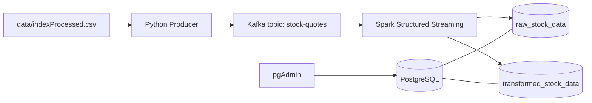

# Stock Data Pipeline

A local **real-time-style stock data pipeline** that replays historical index quotes from a CSV file, streams them through **Apache Kafka**, processes them with **Apache Spark Structured Streaming**, and stores both raw and aggregated results in **PostgreSQL**.

The producer sends one record per second to simulate a live feed. The Spark consumer ingests each quote, writes it to a raw table, and computes **10-minute tumbling window** aggregates (average price, total volume, high, low) per ticker into a second table.

## Architecture



## Technologies

| Layer | Stack |
|--------|--------|
| Messaging | [Apache Kafka](https://kafka.apache.org/) 3.7 (KRaft, single broker) |
| Stream processing | [Apache Spark](https://spark.apache.org/) 3.5.1 — Structured Streaming, Kafka connector, windowed aggregations |
| Storage | [PostgreSQL](https://www.postgresql.org/) 16 |
| Orchestration | [Docker Compose](https://docs.docker.com/compose/) |
| Ingestion (host) | Python 3, [kafka-python](https://pypi.org/project/kafka-python/) |
| Data exploration | [pgAdmin](https://www.pgadmin.org/) 4 (optional UI) |

**Source data:** `data/indexProcessed.csv` — daily index history (e.g. HSI) with columns such as `Index`, `Date`, `Close`, and `Volume`.

## Project layout

```
├── docker-compose.yml      # Kafka, Postgres, Spark, pgAdmin
├── init_db/init.sql        # Creates raw_stock_data and transformed_stock_data
├── scripts/
│   ├── producer.py         # Reads CSV, publishes JSON to Kafka
│   └── spark_consumer.py   # Kafka → Postgres (raw + aggregated)
└── data/
    └── indexProcessed.csv  # Input dataset
```

## Prerequisites

- [Docker Desktop](https://www.docker.com/products/docker-desktop/) (Docker Compose v2)
- **Python 3.8+** on your machine (for the producer only)
- Enough RAM for Spark + Kafka containers (roughly 4 GB+ recommended)

## How to run

Clone or download the repo, then open a terminal in the project root (the folder that contains `docker-compose.yml`).

### 1. Start infrastructure

```bash
docker compose up -d
```

Wait until Kafka, Postgres, Spark, and pgAdmin are healthy. Postgres runs `init_db/init.sql` on first startup and creates the two tables.

### 2. Install producer dependencies (one time)

```bash
pip install kafka-python
```

### 3. Start the Spark consumer

The consumer must be running **before** you start the producer. It uses `startingOffsets=latest`, so it only reads messages that arrive after the stream starts.

```bash
docker exec -it spark /opt/spark/bin/spark-submit /opt/spark/work-dir/scripts/spark_consumer.py
```

The first run may take a few minutes while Spark downloads the Kafka and PostgreSQL JDBC packages.

Leave this terminal open; the job runs until you stop it (`Ctrl+C`).

### 4. Start the producer (second terminal)

From the **project root** (so `data/indexProcessed.csv` resolves correctly):

```bash
python scripts/producer.py
```

Each row is published to the `stock-quotes` topic as JSON (`ticker`, `trade_timestamp`, `price`, `volume`) with a 1-second delay between records.

### 5. Verify data

**PostgreSQL CLI:**

```bash
docker exec -it postgres psql -U admin -d stock_db -c "SELECT * FROM raw_stock_data LIMIT 10;"
docker exec -it postgres psql -U admin -d stock_db -c "SELECT * FROM transformed_stock_data LIMIT 10;"
```

**pgAdmin (browser):** open [http://localhost:8080](http://localhost:8080), sign in, and add a server:

| Setting | Value |
|---------|--------|
| Host | `postgres` (from pgAdmin container) or `host.docker.internal` / your machine IP if connecting from pgAdmin on the host |
| Port | `5432` |
| Database | `stock_db` |
| Username | `admin` |
| Password | `password` |

If pgAdmin runs inside Compose, use host name **`postgres`**. If you use a desktop Postgres client on the host, use **`localhost`**.

### 6. Stop everything

Stop the producer and Spark job with `Ctrl+C`, then:

```bash
docker compose down
```

To remove Postgres data as well:

```bash
docker compose down -v
```

## Default ports and credentials (local dev only)

| Service | Port | Notes |
|---------|------|--------|
| Kafka | `9092` | Host access from producer |
| PostgreSQL | `5432` | User `admin`, password `password`, database `stock_db` |
| pgAdmin | `8080` | Email `admin@admin.com`, password `admin` |

Do not use these credentials in production.

## Troubleshooting

- **No rows in Postgres:** Start the Spark consumer first, then the producer. Confirm Kafka is up: `docker compose ps`.
- **Producer cannot connect to Kafka:** Ensure Docker is running and port `9092` is not in use by another process.
- **Spark package download fails:** Check network access from the Spark container; retry `spark-submit`.
- **Path with spaces (Windows):** Quote the directory, e.g. `cd "D:\Stock data pipeline"`.

## License

Add a license file if you plan to share this repository publicly.
